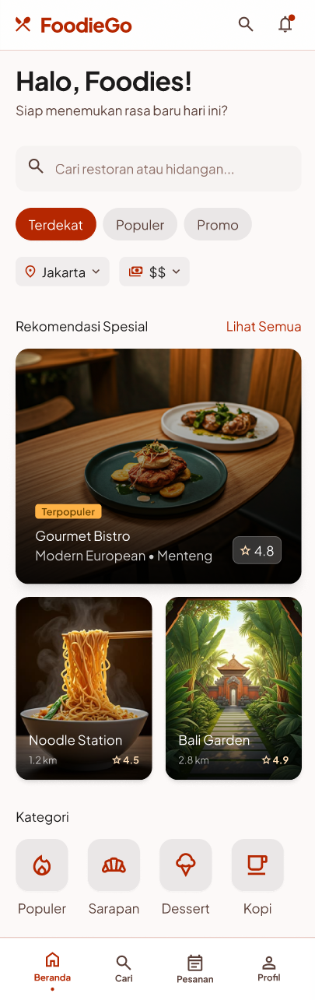
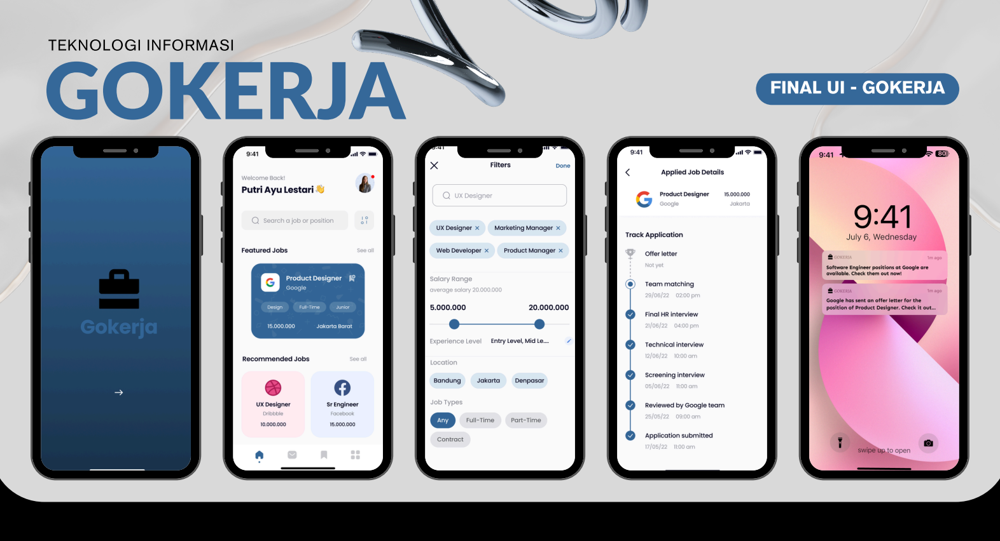
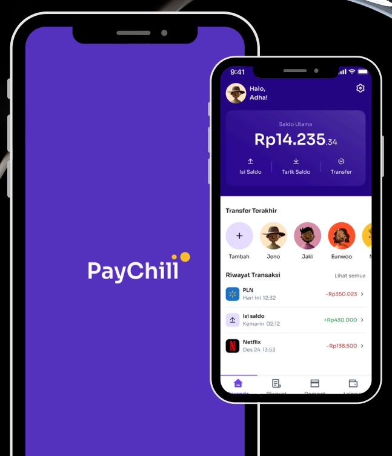

# 🎨 UI/UX Design Portfolio – Kisya Reinatana Yama

> Information Technology Student | Telkom University Jakarta
> Focused on User-Centered Design & Mobile/Web Interface

Hi! I'm Kisya, a UI/UX designer with experience in designing mobile and web applications from user research to high-fidelity prototyping. This repository contains my UI/UX case study projects.

---

## About Me

| | |
|---|---|
| 🎓 **Education** | Bachelor of Information Technology, Telkom University Jakarta |
| 📍 **Location** | North Bekasi, West Java |
| 📧 **Email** | kisyayama05@gmail.com |
| 🔗 **LinkedIn** | [linkedin.com/in/kisyayama](https://linkedin.com/in/kisyayama) |

---

## 📁 Projects

---

### 1. 🍽️ FoodieGo – Restaurant Discovery & Reservation App

> Platform mobile untuk menemukan dan mereservasi restoran terbaik di sekitar pengguna.

**✨ Key Features**
- 🏠 Home – Rekomendasi restoran spesial & kategori makanan
- 🔍 Explore – Pencarian dengan filter harga, rating & lokasi
- 📅 Reservation – Date/time picker & simulasi pembayaran
- 👤 Profile – Riwayat pesanan & restoran favorit
- 🏪 Restaurant Detail – Info lengkap, ulasan & lokasi maps

**🛠️ Tools:** Figma

**🔗 [View Figma Prototype →](https://www.figma.com/design/RJ4DbbSz0nDsguNWzHjwzy/FoodieGo-Studycase?node-id=0-1&t=IP23lOGrPDSl0Yli-1)**

---

### 2. 💼 GoKerja – Job Search & Application Tracking App

> Aplikasi pencarian kerja dan pelacakan lamaran untuk mahasiswa tingkat akhir dan fresh graduate.

**✨ Key Features**
- 🔍 Smart job filtering berdasarkan bidang, lokasi & pengalaman
- 📋 Real-time application status tracking
- 🔔 Push notification untuk update lamaran
- 👤 User persona berbasis riset: mahasiswa & fresh graduate

**🔬 Design Process**
- User Research – wawancara, empathy map, user persona
- Information Architecture & User Flow
- Wireframe → High-Fidelity Prototype
- Usability Testing dengan pengguna nyata di Figma

**🛠️ Tools:** Figma, Miro

**🔗 [View Figma Prototype →](https://www.figma.com/design/zwKG7Ol9TQhVgJAO5b9FmV/Go-Kerja?node-id=8-2&p=f)**

---

### 3. 💳 PayChill – Digital Finance App

> Aplikasi dompet digital yang dirancang khusus untuk pengguna dengan literasi digital rendah.

**✨ Key Features**
- 💰 Top-up, transfer uang & pembayaran tagihan
- 📊 Riwayat transaksi dengan kategori warna
- 🧭 Alur yang sederhana & intuitif untuk semua kalangan
- 📂 Kategori pengeluaran untuk manajemen keuangan

**🔬 Design Process**
- Problem framing untuk pengguna berliterasi digital rendah
- Wireframe → High-Fidelity Prototype dengan fokus simplicity
- Desain komponen yang bersih dan mudah dipahami

**🛠️ Tools:** Figma

**🔗 [View Figma Prototype →](https://www.figma.com/design/CyI2Y7WvgzdGqqhLGkOA95/PayChill?node-id=102-15&t=JhXPBK4o2VVPAPQN-1)**

---

## 🧰 Design Skills

| Skill | Tools |
|---|---|
| Wireframing & Prototyping | Figma |
| User Research | Interviews, Empathy Map, User Persona |
| User Flow & Journey | FigJam, Miro |
| Information Architecture | Figma, Miro |
| Design Handoff | Figma (Dev Mode) |
| Collaboration | Git/GitHub, Google Drive |

---

## 📬 Contact

Interested in working together or have any feedback?

- 📧 kisyayama05@gmail.com
- 🔗 [LinkedIn](https://linkedin.com/in/kisyayama)

---

*This portfolio is actively updated as new projects are completed.*
